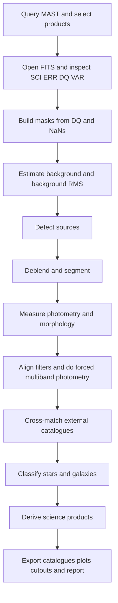

# Designing a Pedagogical JWST MAST Notebook and Analytical Report

## Executive summary

I am treating “JSW” as **JWST**. The strongest design for a target-agnostic teaching notebook is a **MAST-first, public-data workflow** that begins with archive discovery, uses **stage-3 imaging products** for the main scientific notebook path, and exposes **stage-1 and stage-2 branches** when you want to teach detector artefacts, uncertainty propagation, and calibration choices. The official JWST documentation states that MAST hosts JWST data at all processing levels, that archive products are reprocessed on a quarterly build cadence, and that the standard product ladder includes `uncal`, `rate`, `cal`, and resampled stage-3 products such as `i2d`, `s2d`, and `s3d`. citeturn0search0turn13search3turn13search8turn13search1

For the core notebook, the most teachable branch is: **discover public imaging observations → filter products → inspect FITS/HDU structure → build a cleaned science image and variance model → detect and deblend sources → measure photometry and morphology → align bands → do forced multiband photometry → classify stars versus galaxies → cross-match external catalogues → derive science products → export catalogues and a written report**. That sequence aligns closely with the official guidance from entity["organization","Space Telescope Science Institute","baltimore, md, us"], the JWST pipeline documentation, and the Astropy/Photutils ecosystem. citeturn14search1turn13search5turn5search0turn2search3turn4search11turn17search4

The baseline notebook already created in this conversation is a good foundation because it already implements MAST-first discovery, product filtering, FITS inspection, WCS alignment, background subtraction, aperture photometry, radial profiles, and RGB quicklooks; what follows is the research-backed way to expand it into a much more complete scientific teaching notebook and a rigorous analytical report. fileciteturn0file0

The clearest pedagogical stance is to make the notebook **explicitly target-agnostic** until a target is supplied later. That means parameterising `target_name`, `coordinates`, `radius`, `instrument`, `filter_set`, `product_suffix`, `download_limit`, and `catalogue-match radius`, while also including a “known good public imaging field” fallback for demonstration only. MAST’s own primer and the Astroquery MAST documentation both support this discovery-first style. citeturn0search4turn14search0turn14search1

## Notebook architecture and data access

The notebook should have **two parallel teaching tracks**. The first is the **science-ready track**, which starts from stage-3 `i2d` images and is the default for novices. The second is the **pipeline-awareness track**, which optionally steps back to `rate` or `cal` products to show where correlated read noise, data-quality flags, variance arrays, and photometric conversion enter the data model. That separation matters because the JWST documentation makes clear that different suffixes correspond to different processing stages and sometimes different units. citeturn13search5turn13search2turn5search0turn3search0

| Product suffix | What it contains | Best teaching use | Sources |
|---|---|---|---|
| `uncal` | Raw detector ramps in total DN before calibration | Detector-level demonstrations only | citeturn13search8turn13search2 |
| `rate` / `rateints` | Count-rate images after detector processing | Teach jump flags, 1/f noise, pre-resample noise behaviour | citeturn13search5turn25search2 |
| `cal` / `calints` | Calibrated exposures before stage-3 combination | Teach per-exposure photometry and WCS before mosaicking | citeturn13search5turn13search2 |
| `i2d` | Resampled 2-D stage-3 image, usually the cleanest entry point for imaging | Default notebook path for source detection, colours, morphology, cutouts, plots | citeturn13search5turn13search2turn13search1 |
| `segm` / `cat` / `phot` | Pipeline segmentation maps and catalogues when produced | Comparison products, not the only science catalogue | citeturn13search5 |

A novice-friendly notebook should begin with a single environment cell that installs the core Python stack, plus an optional PSF stack. The official documentation for Astroquery, Astropy, Photutils, SEP, Reproject, and STPSF supports exactly the capabilities needed here: archive search, FITS I/O, WCS transforms, segmentation, PSF photometry, reprojection, and model PSFs. citeturn14search1turn2search10turn2search3turn4search11turn1search1turn4search1turn5search2turn5search5

```python
%pip install -U astroquery astropy photutils sep scikit-image scikit-learn \
    reproject pyarrow pandas scipy matplotlib tqdm stpsf
```

The next cell should capture the software environment and notebook provenance before doing any science. This is essential because JWST products are reprocessed over time, Astroquery continues to evolve, and any serious report must record the package versions that produced the results. MAST’s own JWST access documentation explicitly notes the quarterly update cadence for reprocessed products. citeturn0search0turn26search6

```python
import json
import sys
import platform
import importlib.metadata as md
from datetime import datetime, timezone

PKGS = [
    "astroquery", "astropy", "photutils", "sep", "scikit-image",
    "scikit-learn", "reproject", "pandas", "pyarrow", "scipy", "matplotlib"
]

env = {
    "python": sys.version,
    "platform": platform.platform(),
    "utc_created": datetime.now(timezone.utc).isoformat(),
    "packages": {p: md.version(p) for p in PKGS if p in {d.metadata['Name'] for d in md.distributions()}},
}
with open("environment_manifest.json", "w") as f:
    json.dump(env, f, indent=2)
env
```

For data discovery, the notebook should use `astroquery.mast.Observations` rather than raw HTTP calls, because the official Astroquery MAST interface already exposes observation queries, product listing, product filtering, and cloud-backed public downloads. One common pitfall worth teaching explicitly is that `get_product_list` expects **`obsid`**, not **`obs_id`**. citeturn14search0turn14search1turn26search1

```python
from astroquery.mast import Observations
from astropy.table import Table

target_name = "TARGET_OR_FIELD"
radius = "0.03 deg"

obs = Observations.query_object(target_name, radius=radius)

# Narrow to public JWST imaging observations
obs = obs[
    (obs["obs_collection"] == "JWST") &
    ((obs["dataRights"] == "PUBLIC") | (obs["dataRights"] == "")) &
    ((obs["dataproduct_type"] == "image") | (obs["dataproduct_type"] == ""))
]

obs[:5]
```

A second discovery cell should demonstrate richer metadata filtering. This is where you teach the user to think like an archive scientist: mission, instrument, product level, filters, date ranges, exposure time, and public/private state. Astroquery’s `query_criteria` and metadata access exist precisely for this pattern. citeturn14search0turn14search1

```python
obs2 = Observations.query_criteria(
    obs_collection="JWST",
    instrument_name=["NIRCAM/IMAGE", "MIRI/IMAGE"],
    dataproduct_type="image",
    dataRights="PUBLIC",
)
obs2[:5]
```

Product retrieval should then teach three ideas: **product list expansion**, **server-side filtering**, and **download strategy**. The documentation shows that `get_product_list`, `filter_products`, `download_products`, `list_cloud_datasets`, and cloud-aware download options all exist for exactly this reason. citeturn14search0turn26search1turn26search5

```python
# Optional: enable cloud-hosted public datasets when available
Observations.enable_cloud_dataset()

products = Observations.get_product_list(obs[:3])  # small subset for pedagogy
products = Observations.filter_products(
    products,
    productType=["SCIENCE", "PRODUCT"],
    extension=["fits", "fits.gz"],
)

# Prefer resampled stage-3 imaging products for the main notebook path
keep = [row for row in products if str(row["productFilename"]).endswith("_i2d.fits")]
manifest = Observations.download_products(Table(rows=keep), download_dir="mast_data", flat=True)
manifest[:5]
```

The first FITS-handling cell should then show how JWST science products are structured and how to retrieve `SCI`, `ERR`, `DQ`, and variance arrays when present. Astropy’s FITS and WCS docs, together with JWST science-product documentation, support this exact teaching pattern. citeturn2search2turn0search6turn5search0turn5search3

```python
from astropy.io import fits
from astropy.wcs import WCS
from astropy.nddata import Cutout2D
import numpy as np

path = "mast_data/example_i2d.fits"
with fits.open(path) as hdul:
    hdul.info()
    sci = hdul["SCI"].data.astype("float32")
    err = hdul["ERR"].data.astype("float32") if "ERR" in hdul else None
    dq = hdul["DQ"].data if "DQ" in hdul else None
    var_poisson = hdul["VAR_POISSON"].data.astype("float32") if "VAR_POISSON" in hdul else None
    var_rnoise = hdul["VAR_RNOISE"].data.astype("float32") if "VAR_RNOISE" in hdul else None
    var_flat = hdul["VAR_FLAT"].data.astype("float32") if "VAR_FLAT" in hdul else None
    area = hdul["AREA"].data.astype("float32") if "AREA" in hdul else None
    wcs = WCS(hdul["SCI"].header)

cut = Cutout2D(sci, position=(sci.shape[1] / 2, sci.shape[0] / 2), size=(512, 512), wcs=wcs)
cut.data.shape
```

## Analysis workflow and core measurement cells

The official JWST and Photutils documentation strongly suggest that a good notebook should not jump straight from image display to source measurement. It should first make explicit the chain **masking → background estimation → noise model → detection threshold → segmentation → deblending → catalogue construction**. That is the conceptual hinge that turns a pretty image notebook into a scientific analysis notebook. citeturn3search15turn12search6turn17search0turn5search0



That flow follows the official separation between archive search, FITS/WCS handling, image segmentation, and stage-dependent data products in the JWST and Astropy ecosystems. citeturn14search1turn2search2turn0search6turn12search6turn13search5

A robust background cell should combine the **DQ mask** with a **source mask** and use either **Photutils `Background2D`** or **SEP’s `Background`**. The Photutils documentation makes the important point that background estimation has no universally correct recipe and must be tuned to the scene; that is exactly the sort of pedagogical warning the notebook should foreground. citeturn3search15turn4search21turn5search0

```python
from photutils.background import Background2D, MedianBackground
from astropy.stats import SigmaClip
import numpy as np

bad = ~np.isfinite(sci)
if dq is not None:
    bad |= (dq != 0)

sigma_clip = SigmaClip(sigma=3.0, maxiters=10)
bkg = Background2D(
    sci,
    box_size=(64, 64),
    filter_size=(3, 3),
    mask=bad,
    sigma_clip=sigma_clip,
    bkg_estimator=MedianBackground(),
)

data_sub = sci - bkg.background
bkg_rms = bkg.background_rms
```

The notebook should also include a **SEP alternative cell** because SEP is still one of the fastest ways to teach classical source extraction inside a notebook, and because it descends from Source Extractor logic. A subtle but very useful pedagogical detail is that SEP uses **0-based Python coordinates**, while Source Extractor catalogue outputs follow FITS-style **1-based image coordinates**; learners often get bitten by that. citeturn1search1turn1search5turn1search13

```python
import sep

sep_data = np.ascontiguousarray(data_sub.astype(np.float32))
sep_bkg = sep.Background(sep_data, mask=bad)
sep_sub = sep_data - sep_bkg.back()
objects, segmap = sep.extract(
    sep_sub,
    thresh=2.5,
    err=sep_bkg.rms(),
    minarea=8,
    deblend_nthresh=32,
    deblend_cont=0.005,
    segmentation_map=True,
)
len(objects)
```

For the main catalogue-building branch, I would recommend **Photutils segmentation** as the primary teaching implementation and **SEP** as the comparison implementation. Photutils integrates naturally with Astropy tables and exposes source properties, local background handling, Kron-style photometry, centroids, and morphology in one coherent API. citeturn12search6turn12search15turn17search0turn1search0

```python
from astropy.convolution import convolve
from photutils.segmentation import (
    make_2dgaussian_kernel, detect_threshold, detect_sources,
    deblend_sources, SourceCatalog
)

kernel = make_2dgaussian_kernel(fwhm=3.0, size=5)
conv = convolve(data_sub, kernel, normalize_kernel=True)

threshold = detect_threshold(conv, nsigma=2.5, background=0.0, error=bkg_rms)
segm = detect_sources(conv, threshold, npixels=8)
segm_deblend = deblend_sources(conv, segm, npixels=8, nlevels=32, contrast=0.001)

cat = SourceCatalog(
    data_sub,
    segm_deblend,
    convolved_data=conv,
    error=err,
    background=bkg.background,
)
tbl = cat.to_table()
tbl[:5]
```

Photometry should then branch into **fixed-aperture**, **adaptive/Kron-like**, and **PSF-fitting** modes. The notebook should explicitly teach that the “right” choice depends on crowding, source morphology, and the question being asked. Photutils supports aperture photometry, circular-annulus local backgrounds, radial profiles, curves of growth, and PSF photometry; that makes it ideal for teaching the progression from simple to advanced measurement. citeturn3search6turn4search2turn3search2turn3search18

```python
from photutils.aperture import CircularAperture, CircularAnnulus, aperture_photometry
from photutils.profiles import CurveOfGrowth, RadialProfile

xy = np.column_stack([tbl["xcentroid"], tbl["ycentroid"]])

aper = CircularAperture(xy, r=4.0)
ann = CircularAnnulus(xy, r_in=6.0, r_out=10.0)

phot = aperture_photometry(data_sub, aper, error=err)
ann_phot = aperture_photometry(data_sub, ann, error=err)

# Single-source profile demo
x0, y0 = float(tbl["xcentroid"][0]), float(tbl["ycentroid"][0])
radii = np.arange(1, 20)
rp = RadialProfile(data_sub, (x0, y0), radii, error=err)
cog = CurveOfGrowth(data_sub, (x0, y0), radii, error=err)
```

The notebook should then include a dedicated **calibration and zero-point cell**. The `photom` step documentation explains that JWST photometric calibration uses PHOTOM and pixel-area reference information, and that imaging products can carry an `AREA` extension. For `i2d` images in surface-brightness units, the notebook should teach users to convert integrated aperture sums to flux by multiplying by pixel area, then applying AB magnitude conversion; for point sources, it should apply an aperture correction derived from encircled-energy curves or an empirical curve of growth. STScI’s NIRCam PSF and zeropoint pages explicitly note that resampling affects the PSF core and that aperture corrections for `i2d` products matter. citeturn3search0turn3search3turn13search9turn3search1

```python
import numpy as np

pixar_sr = fits.getheader(path, "SCI").get("PIXAR_SR")  # if present
aper_sum_mjy_sr_pix = phot["aperture_sum"][0]           # weighted sum in MJy/sr * pixel
flux_jy = 1e6 * pixar_sr * aper_sum_mjy_sr_pix          # MJy -> Jy
apcorr = 1.12                                           # example, derive from COG or STPSF
flux_jy_corr = flux_jy * apcorr
mag_ab = -2.5 * np.log10(flux_jy_corr / 3631.0)
mag_ab
```

Completeness and reliability should be taught as **experiments**, not merely as catalogue metadata. The notebook should inject both **artificial stars** and **artificial Sérsic galaxies** into representative sky patches, rerun the full detection and measurement chain, and estimate recovery fraction as a function of magnitude, size, background, and crowding. Reliability should be assessed from negative-image tests, blank-aperture statistics, and injection-based false-positive estimates. Injection-and-recovery is a standard catalogue-validation strategy in survey pipelines, and crowded-field stellar work likewise depends on artificial-source testing. citeturn19search1turn12search0turn11search2

```python
from astropy.modeling.models import Sersic2D
from photutils.psf import CircularGaussianPRF
from photutils.datasets import make_model_image
from astropy.table import Table

# Artificial stars
star_model = CircularGaussianPRF(flux=500.0, x_0=0, y_0=0, fwhm=2.8)
star_params = Table({
    "x_0": np.random.uniform(50, sci.shape[1]-50, 200),
    "y_0": np.random.uniform(50, sci.shape[0]-50, 200),
    "flux": 10**np.random.uniform(1.0, 3.5, 200),
    "fwhm": np.full(200, 2.8),
})
stars = make_model_image(sci.shape, star_model, star_params)

# Artificial galaxies
yy, xx = np.mgrid[:sci.shape[0], :sci.shape[1]]
gal = Sersic2D(amplitude=0.02, r_eff=4.0, n=1.5, x_0=300, y_0=400, ellip=0.3, theta=0.5)
gals = gal(xx, yy)

sim = data_sub + stars + gals
# rerun background -> detection -> catalogue on sim, then compare recovered vs injected
```

The visualisation chapter should go beyond “show an image”. It should explicitly teach **RGB composites**, **contour overlays**, **radial profiles**, **cutouts**, and **segmentation-map diagnostics**, because each of these teaches a different scientific question: colour structure, isophotal extent, PSF shape, local crowding, or deblending success. The Astropy and Photutils docs support these patterns directly. citeturn4search0turn4search2turn17search4

```python
import matplotlib.pyplot as plt
from astropy.visualization import make_lupton_rgb, simple_norm

# RGB
rgb = make_lupton_rgb(red_img, green_img, blue_img, stretch=0.5, Q=8)
plt.figure(figsize=(8, 8))
plt.imshow(rgb)
plt.title("JWST RGB quicklook")
plt.axis("off")

# Contours on top of grayscale
plt.figure(figsize=(8, 8))
plt.imshow(data_sub, origin="lower", cmap="gray", norm=simple_norm(data_sub, "asinh", percent=99.5))
plt.contour(segm_deblend.data > 0, levels=[0.5], colors="cyan", linewidths=0.3)
plt.title("Contours from segmentation map")
plt.axis("off")

# Radial profile
plt.figure(figsize=(6, 4))
plt.plot(rp.radius, rp.profile, marker="o")
plt.xlabel("Radius [pixels]")
plt.ylabel("Mean surface brightness")
plt.title("Radial profile")
plt.grid(alpha=0.3)
plt.show()
```



```mermaid
gantt
    title Suggested notebook teaching order
    dateFormat  X
    axisFormat %s
    section Discovery
    Query MAST and inspect metadata     :a1, 0, 1
    Expand products and download files  :a2, after a1, 1
    section Image understanding
    Inspect FITS, WCS, SCI/ERR/DQ/VAR   :b1, after a2, 1
    Background and noise modelling      :b2, after b1, 1
    section Measurement
    Detection and deblending            :c1, after b2, 1
    Photometry and morphology           :c2, after c1, 1
    Alignment and forced photometry     :c3, after c2, 1
    section Inference
    Star-galaxy separation              :d1, after c3, 1
    Cross-match and photo-z basics      :d2, after d1, 1
    Derived science products            :d3, after d2, 1
    section Deliverables
    Export tables, plots, cutouts       :e1, after d3, 1
    Write executive report              :e2, after e1, 1
```

## Star–galaxy separation and science products

The key teaching message here should be that **star–galaxy separation is not one algorithm but a hierarchy of evidence**. In JWST imaging, the first and most reliable layer is usually **shape relative to the local PSF**; the second is **concentration and flux-radius behaviour**; the third is **colour information**; the fourth is **external astrometric labels from Gaia when bright foreground stars are available**; and the fifth is **supervised classification trained on high-confidence subsets**. This layered approach is more defensible than any single threshold. citeturn22search5turn22search1turn17search0turn15search7turn9search3

A practical notebook should therefore compute, for every source: centroid, semimajor/semiminor axes, elongation, ellipticity, isophotal area, circular or Kron-like flux, half-light radius, a concentration metric, local background, and at least one PSF-relative size metric. Photutils `SourceCatalog`, Scikit-image `regionprops`, and optional SExtractor-derived metrics cover these needs well. citeturn17search0turn17search1turn22search6

| Evidence family | Stellar behaviour | Galaxy behaviour | Teaching note |
|---|---|---|---|
| FWHM relative to PSF | Close to local PSF width | Broader than PSF | Best first discriminator in uncrowded data |
| Concentration | High central concentration in PSF core | Lower core concentration for same apparent brightness | Works well when S/N is decent |
| Ellipticity / elongation | Often modest unless diffraction features or blends interfere | Can be intrinsically elliptical or irregular | Never use alone |
| PSF-fit residuals | Small after a good PSF fit | Structured residuals remain | Excellent diagnostic for stars in moderate crowding |
| Colours | Often form a narrow stellar locus | Broader distribution; redshift broadens locus further | Filter-set dependent |
| Gaia parallax/proper motion | Positive and measurable for bright foreground stars | Effectively zero for background galaxies | Only available for the bright end |

The notebook should also be honest about the strengths and weaknesses of legacy classifiers. SExtractor’s `CLASS_STAR` is historically important and still pedagogically useful, but the official SExtractor docs say it has been superseded by `SPREAD_MODEL`; they also note that the training used simulated images with a Moffat-style PSF and was **not optimised for space-based diffraction-limited images**. In a JWST teaching notebook, that is exactly the sort of caveat worth surfacing explicitly. citeturn22search5turn22search2turn8search2

```python
# Simple heuristic classifier using PSF-relative size and concentration
import numpy as np
import pandas as pd

df = tbl.to_pandas()

# Example placeholders: replace with empirical measurements
psf_fwhm_pix = 2.8
df["size_ratio"] = df["fwhm"] / psf_fwhm_pix
df["concentration"] = df["segment_flux"] / df["kron_flux"]

df["class_rule"] = "uncertain"
df.loc[(df["size_ratio"] < 1.15) & (df["concentration"] > 0.72), "class_rule"] = "star_like"
df.loc[(df["size_ratio"] > 1.25) | (df["concentration"] < 0.65), "class_rule"] = "galaxy_like"

df[["label", "size_ratio", "concentration", "class_rule"]].head()
```

For a more modern chapter, the notebook should include a **supervised classifier** built on morphology and colours, trained only on high-confidence labels. The Scikit-learn `Pipeline` and `RandomForestClassifier` APIs are well suited to a pedagogical implementation because they are readable, robust to mixed feature scales, and straightforward to validate. citeturn1search6turn1search3turn1search14

```python
from sklearn.model_selection import train_test_split
from sklearn.pipeline import Pipeline
from sklearn.impute import SimpleImputer
from sklearn.ensemble import RandomForestClassifier
from sklearn.metrics import classification_report

feature_cols = [
    "fwhm", "elongation", "ellipticity", "area",
    "mag_f090w", "mag_f150w", "mag_f200w",
    "colour_f090w_f150w", "colour_f150w_f200w"
]

train = df[df["label_truth"].notna()].copy()
X = train[feature_cols]
y = train["label_truth"]  # e.g. "star" / "galaxy"

X_train, X_test, y_train, y_test = train_test_split(
    X, y, test_size=0.25, random_state=42, stratify=y
)

clf = Pipeline([
    ("impute", SimpleImputer(strategy="median")),
    ("rf", RandomForestClassifier(
        n_estimators=400,
        max_depth=None,
        min_samples_leaf=3,
        random_state=42,
        n_jobs=-1,
    )),
])

clf.fit(X_train, y_train)
pred = clf.predict(X_test)
print(classification_report(y_test, pred))
```

For point sources in crowded fields, the notebook should say clearly that **PSF-fitting photometry** is the preferred science-grade method, while **aperture photometry** is the preferred teaching entry point and still perfectly valid for isolated sources. The Photutils PSF framework, the classic DAOPHOT literature, and the recent JWST NIRCam/NIRISS DOLPHOT modules all support that division of labour. citeturn3search18turn12search0turn12search5turn11search2

Crowded stellar fields, nearby resolved galaxies, and deep extragalactic blank fields all look very different in JWST imaging, and the notebook should teach that the settings for deblending, completeness, and classification must change with scene structure rather than being blindly reused across all science cases. citeturn12search6turn3search15turn11search2

image_group{"layout":"carousel","aspect_ratio":"16:9","query":["JWST NIRCam deep field galaxies", "JWST NIRCam star forming region pillars", "JWST galaxy cluster gravitational lensing image", "JWST MIRI nearby galaxy image"], "num_per_query": 1}

## Catalogue fusion, redshifts and derived products

Astrometric alignment should be taught in two stages. First, use the FITS WCS to put all images onto a common celestial frame. Second, refine the alignment empirically using bright compact sources, ideally tied to Gaia when the field contains enough unsaturated foreground stars. The Astropy WCS and coordinate-matching documentation support the first stage; Reproject handles resampling onto a common grid; and the Gaia ecosystem provides the most useful external absolute reference for the bright end. citeturn0search6turn2search3turn4search1turn15search0turn15search3turn8search1

A very important caveat should be stated explicitly: **Reproject assumes the WCS is already correct; it resamples images, but it does not solve registration problems caused by incorrect or missing WCS**. For difference imaging, precise colours, and radial profiles, learners need to understand that distinction. citeturn24search1turn4search14

```python
from reproject import reproject_interp
from astropy.io import fits

with fits.open("mast_data/filter_A_i2d.fits") as hdu_ref, fits.open("mast_data/filter_B_i2d.fits") as hdu_mov:
    ref_data = hdu_ref["SCI"].data
    ref_wcs = WCS(hdu_ref["SCI"].header)
    mov_data = hdu_mov["SCI"].data
    mov_wcs = WCS(hdu_mov["SCI"].header)

aligned_B, footprint = reproject_interp((mov_data, mov_wcs), ref_wcs, shape_out=ref_data.shape)
```

External cross-matching should be demonstrated with three archives. For bright stars and an absolute astrometric tie, use the **Gaia Archive** exposed either through Astroquery or through the entity["organization","European Space Agency","space agency"] Gaia services. For optical colour context and shape information over wide areas, use **Pan-STARRS** via MAST’s catalogue services. For fields within its footprint and for small object lists especially, use **SDSS** via SkyServer Cross-ID or Astroquery’s SDSS interface. 
```python
# Gaia cross-match
from astroquery.gaia import Gaia
from astropy.coordinates import SkyCoord
import astropy.units as u

centre = SkyCoord(ra=150.1163*u.deg, dec=2.2058*u.deg, frame="icrs")
job = Gaia.cone_search_async(centre, radius=3*u.arcmin)
gaia = job.get_results()

# Internal source coordinates
src = SkyCoord(df["ra"]*u.deg, df["dec"]*u.deg)
gcat = SkyCoord(gaia["ra"]*u.deg, gaia["dec"]*u.deg)

idx, sep2d, _ = src.match_to_catalog_sky(gcat)
match_mask = sep2d < 0.3*u.arcsec
df.loc[match_mask, "gaia_source_id"] = gaia["SOURCE_ID"][idx[match_mask]]
df.loc[match_mask, "parallax"] = gaia["parallax"][idx[match_mask]]
df.loc[match_mask, "pm"] = np.hypot(gaia["pmra"][idx[match_mask]], gaia["pmdec"][idx[match_mask]])
```

```python
# Pan-STARRS via MAST Catalogs
from astroquery.mast import Catalogs

ps1 = Catalogs.query_region(
    "150.1163 2.2058",
    radius=0.05,
    catalog="Panstarrs",
    table="stack",
    release="dr2"
)
ps1[:5]
```

```python
# SDSS example via astroquery
from astroquery.sdss import SDSS
sdss = SDSS.query_region(centre, radius=2*u.arcmin)
sdss[:5] if sdss is not None else None
```

A pedagogical report should explain **photometric redshift estimation** as a layered concept rather than pretending that a few lines of code produce publication-grade photo-z values. The modern literature distinguishes **template fitting**, **machine learning**, and **hybrid** approaches. In this notebook, the most honest implementation is a **baseline ML regressor** trained on a matched catalogue with known redshifts, accompanied by a clear statement that production photo-z work usually needs a specialist package, priors, and careful domain matching. The review literature supports that framing. citeturn9search3turn9search0

```python
from sklearn.ensemble import RandomForestRegressor

photoz_cols = [
    "colour_f090w_f150w", "colour_f150w_f200w", "colour_f200w_f356w",
    "mag_f200w", "size_ratio", "concentration"
]

train_z = df[df["z_spec"].notna()].copy()
reg = Pipeline([
    ("impute", SimpleImputer(strategy="median")),
    ("rf", RandomForestRegressor(
        n_estimators=500, random_state=42, n_jobs=-1
    ))
])
reg.fit(train_z[photoz_cols], train_z["z_spec"])
df["z_phot_ml"] = reg.predict(df[photoz_cols])
```

The notebook should then pivot from measurement to **scientific interpretation**. The products below can all be derived from the same multiband catalogue, but each teaches something different.

| Derived product | Minimum ingredients | What it teaches |
|---|---|---|
| Luminosity function | Calibrated magnitudes, completeness correction, distance or redshift bin | Selection effects, completeness, population statistics |
| Surface-brightness profile | Image cutout, centre, elliptical isophote fit or radial profile | Galaxy structure, disc versus bulge behaviour |
| Colour–magnitude diagram | Forced multiband photometry; good stellar field preferred | Stellar populations, extinction trends, evolved sequences |
| Star–galaxy diagnostic plane | FWHM, concentration, colour, external labels | Classifier interpretability |
| Morphological classes | Segmentation, shape measures, optional Sérsic fits | Population demographics, merger fraction, disc/compact fractions |
| Size measurements | Half-light radius, Kron radius, Sérsic `r_eff` | Physical scale evolution and size–luminosity relations |
| Sérsic fitting | Good sky estimate, mask, PSF, initial guesses | Parametric structure and residual analysis |
| Transient search | Two epochs, aligned images, PSF matching, DQ-aware subtraction | Change detection and false-positive control |

For simple structural analysis, Astropy’s `Sersic2D` and Photutils isophote tools are enough to teach the logic of profile fitting. For serious multi-component galaxy decomposition, GALFIT remains the more appropriate external tool. The classic and later GALFIT papers, plus the Photutils isophote documentation, support that division very clearly. citeturn29search0turn29search2turn17search4turn8search10turn8search3

```python
# Simple pedagogical Sérsic fit with astropy.modeling
from astropy.modeling.models import Sersic2D
from astropy.modeling.fitting import LevMarLSQFitter

yy, xx = np.mgrid[:cut.data.shape[0], :cut.data.shape[1]]
model0 = Sersic2D(
    amplitude=np.nanpercentile(cut.data, 99),
    r_eff=10.0,
    n=1.5,
    x_0=cut.data.shape[1] / 2,
    y_0=cut.data.shape[0] / 2,
    ellip=0.2,
    theta=0.0,
)

fit = LevMarLSQFitter()
model_fit = fit(model0, xx, yy, cut.data)
model_fit
```

For transient search, the notebook should teach **WCS refinement → PSF matching → flux scaling → subtraction → significance testing → DQ inspection**, never raw image subtraction by eye. Photutils exposes PSF-matching utilities, and the JWST pipeline provides stage-3 outlier-detection logic for imaging associations that is useful background reading. citeturn24search2turn24search4turn25search15turn24search1

## Tool comparison and recommended stack

The most useful comparison table is not “which package is best”, but **which package is best for which notebook chapter**.

| Tool | Strengths | Weaknesses | Best use in this notebook | Sources |
|---|---|---|---|---|
| **SExtractor** | Mature, fast, strong deblending, dual-image mode, `CLASS_STAR` and `SPREAD_MODEL`, weight-map aware | External CLI workflow; less natural inside pure-Python notebooks; some classifiers carry assumptions not ideal for JWST PSFs | Benchmark comparison, dual-image forced photometry demonstrations, survey-style catalogues | citeturn6search13turn6search17turn11search3turn22search5turn22search1 |
| **SEP** | Pythonic, fast, excellent for notebook prototyping, segmentation map support, easy Source Extractor-style extraction | Lower-level than Photutils; fewer built-in downstream astronomy abstractions; coordinate-convention gotcha | Alternate detector for speed and comparison against Photutils | citeturn1search1turn1search5turn1search13 |
| **Photutils** | Native Python, integrates with Astropy tables/WCS, segmentation, aperture photometry, PSF photometry, profiles, isophote fitting | Can be slower than SEP on very large frames; fewer “one-shot survey pipeline” features than SExtractor | **Primary notebook implementation** for teaching and reproducibility | citeturn4search11turn12search6turn3search15turn3search18turn17search4 |
| **DAOPhot / DAOFIND** | Classic crowded-field stellar photometry; still the conceptual gold standard for dense stellar fields | Not designed for extended galaxies; older workflow; best for stellar, not mixed morphology scenes | Conceptual chapter on crowded-field stars; optional advanced branch | citeturn12search0turn12search5 |
| **SourceXtractor++** | Modern detection/collection/measurement framework; model fitting; multi-image measurement using WCS | More complex setup; association mode is not true forced photometry unless objects are detected on the detection image | Advanced “survey-grade multiband catalogue” appendix | citeturn6search12turn11search1turn6search8 |
| **GALFIT** | Excellent 2-D parametric galaxy fitting and multi-component decomposition | Sensitive to sky, sigma image, PSF mismatch, neighbour masks, and initial guesses | External structural-fitting chapter after the main Python catalogue exists | citeturn8search3turn6search5turn6search9 |
| **ProFound** | Strong segmentation-led approach, good for irregular extended sources, natural hand-off to ProFit | R-first ecosystem rather than pure Python; less straightforward for a JWST-first Python notebook | Comparative note for irregular galaxies and extended low-surface-brightness work | citeturn23search0turn23search1 |

My recommendation for the actual notebook is therefore: **Astroquery + Astropy + Photutils** as the backbone, **SEP** as the alternative detector, **Scikit-image** for additional morphology and region measurements, **Scikit-learn** for explicit pedagogical classifiers and photo-z baselines, **Reproject** for common-grid resampling, and **STPSF** for PSF-informed work. Bring in **SExtractor**, **SourceXtractor++**, or **GALFIT** only in advanced modules or comparison chapters, not as the first notebook path. That split keeps the notebook readable for novices while remaining scientifically serious. citeturn14search1turn4search11turn1search1turn17search1turn1search14turn4search1turn5search2

## Quality assurance, reproducibility and deliverables

The quality-assurance chapter should be treated as a scientific result, not an appendix. At minimum, the notebook should report: **fraction of masked pixels**, **background RMS map statistics**, **WCS residuals after alignment**, **aperture-versus-PSF flux residuals for bright stars**, **classification confusion matrix for labelled subsets**, **completeness curves from injection/recovery**, **false-detection rates from negative-image tests**, and **difference-image residual diagnostics** for any transient analysis. JWST science products carry `ERR`, `DQ`, and variance arrays, and resampled variance handling is documented; but because drizzle-like resampling correlates neighbouring pixels, empirical blank-aperture tests remain essential. citeturn5search0turn25search5turn25search7turn24search1

The notebook should also include an explicit **provenance cell** that saves: object/region query parameters, returned observation identifiers, product filenames, download manifest, FITS headers of the science products used, software versions, and the UTC date of execution. This matters not only for reproducibility, but also because JWST archive products change with pipeline builds over time. Astropy’s unified table I/O makes it straightforward to serialise these products to CSV, ECSV, and Parquet. citeturn0search0turn28search0turn28search2turn28search13

```python
from astropy.table import Table

# Save the main catalogue with metadata preserved when possible
t = Table.from_pandas(df)

t.write("jwst_catalog.ecsv", overwrite=True)
t.write("jwst_catalog.parquet", format="parquet", overwrite=True)
t.write("jwst_catalog.fits", overwrite=True)

# Also save a plain CSV for convenience
df.to_csv("jwst_catalog.csv", index=False)
```

A sensible set of deliverables is:

| Deliverable | Format | Purpose | Notes |
|---|---|---|---|
| Main source catalogue | ECSV + Parquet + CSV | Human-readable + efficient analysis storage | Use ECSV for units/metadata and Parquet for speed |
| Diagnostic plots | PNG and PDF | Segmentation maps, CMDs, colour–colour planes, FWHM histograms, completeness curves | Keep plot-generating cells deterministic |
| Science cutouts | FITS | Object-level follow-up and report figures | Preserve cutout WCS with `Cutout2D` |
| Aligned multiband stacks | FITS | Forced photometry and colour products | Record reference band and reprojection method |
| Segmentation maps | FITS | Audit detection/deblending choices | Save label map and parent-child relationships if relevant |
| Written report | Markdown, HTML, or PDF | Executive summary, interpretation, limitations, provenance | Generate after catalogue QA, not before |

The written report itself should open with an **executive summary**, then move through **data provenance**, **selection criteria**, **measurement methods**, **classification logic**, **derived science products**, **sensitivity/completeness limits**, **main interpretations**, and **known limitations**. That matches the way the official archive and pipeline documentation are structured: first establish what data you used, then what processing stage they are in, then what inferences they justify. citeturn0search0turn13search5turn5search3

For a novice, the most reproducible execution checklist is:

- install and freeze the environment before querying MAST; save a JSON manifest of package versions. citeturn0search0turn26search6  
- query MAST for **public JWST imaging** only, and record both the discovery query and the returned product names. citeturn0search4turn14search1  
- prefer `i2d` for the main notebook path, but inspect `rate`/`cal` examples so you understand where noise and calibration information enter. citeturn13search5turn5search0  
- inspect `SCI`, `ERR`, `DQ`, `VAR_POISSON`, `VAR_RNOISE`, `VAR_FLAT`, and `AREA` whenever present. citeturn5search0turn3search0  
- estimate background and RMS before detection, and compare a Photutils branch to an SEP branch at least once. citeturn3search15turn1search1turn12search6  
- build a segmentation catalogue, then add aperture and optional PSF photometry. citeturn12search6turn3search18  
- align bands on a common WCS, remembering that reprojection is not registration correction. citeturn24search1turn2search3  
- perform forced multiband photometry and compute colours before attempting star–galaxy separation or photo-z estimation. citeturn11search3turn9search3  
- validate catalogue depth and purity with injection/recovery and false-positive tests, not by eye alone. citeturn19search1turn11search2  
- export catalogues, plots, cutouts, and a written report that states clearly which product stage and calibration assumptions were used. citeturn13search5turn28search0turn28search13

The overall conclusion is that a **very detailed pedagogical notebook is entirely feasible without choosing a specific target now**, provided it is designed around **public JWST imaging products**, **explicit stage awareness**, **parallel implementations of detection/measurement**, **transparent quality control**, and **science products that are traceable back to catalogue-level evidence**. That is the combination most likely to teach a novice what information can truly be extracted from MAST-hosted JWST data, while still giving an advanced user a credible foundation for publication-grade follow-up. citeturn0search12turn0search17turn14search1turn13search5
